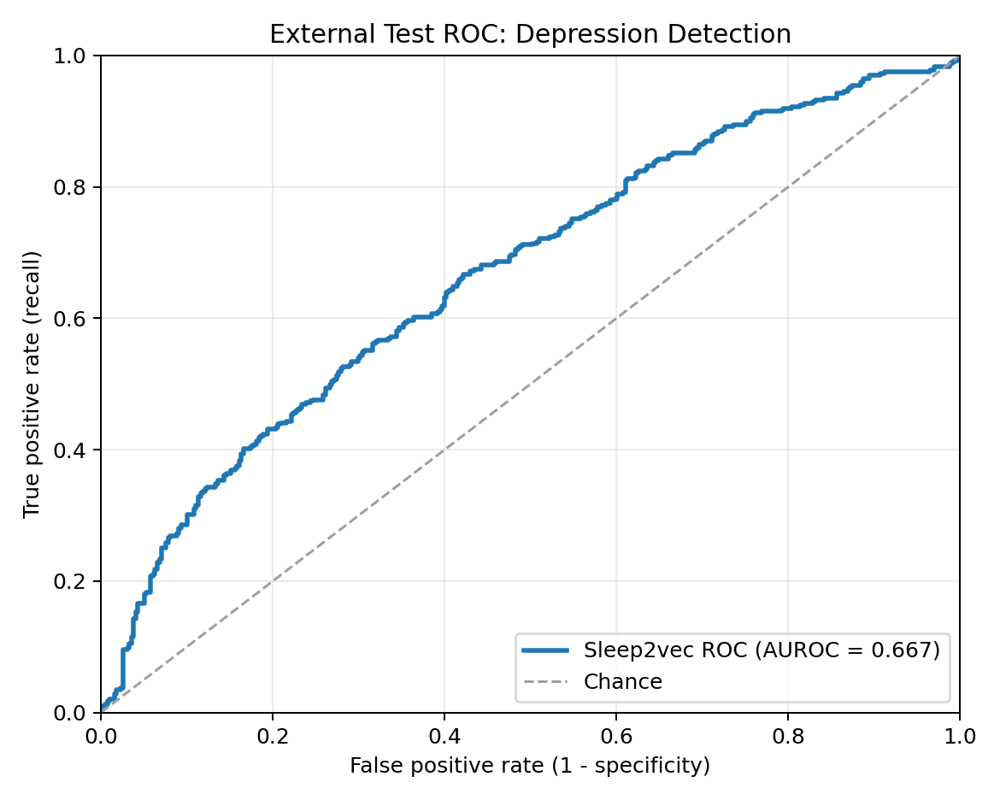
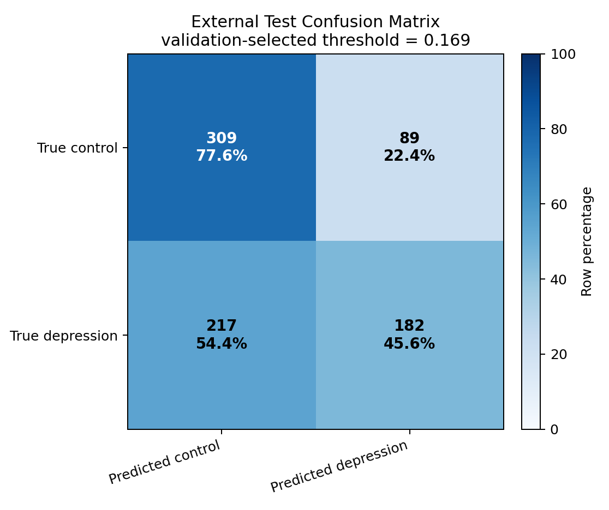

# Best External Validation Result: Depression Detection

## Selected Run

- Run/checkpoint: `dep_excl_hbbr_kaldi_top2_lr8e-4_do0p2_epoch20`
- Model/input setting: `heartbeat + breath`, Kaldi backend, CLS token downstream, frozen backbone/tokenizer, head-only fine-tuning.
- Layer mix: enabled, modality-specific, top-2 layers `[15, 16]`.
- Learning rate/dropout: `lr=8e-4`, head dropout `0.2`.
- Checkpoint selection: epoch 20 was selected by internal validation AUROC.
- External cohort: true held-out Neimenggu + Neimenggu parallel test cohort.
- Threshold policy: threshold was selected on validation set only (`val_max_f1` / Youden, both gave `0.169`), then applied once to external test.

## External Test Metrics

| Metric | Value |
|---|---:|
| AUROC | 0.667 |
| Accuracy | 0.616 |
| F1 | 0.543 |
| Precision | 0.672 |
| Recall / sensitivity | 0.456 |
| Specificity | 0.776 |
| Threshold | 0.169 |
| TP / TN / FP / FN | 182 / 309 / 89 / 217 |

For reference, the same checkpoint at the default threshold `0.5` had AUROC `0.667`, accuracy `0.565`, F1 `0.293`, recall `0.180`, and specificity `0.950`. The validation-selected threshold mainly improves the operating point, not the ranking AUROC.

## Comparison To Screenshot Baseline

| Metric | Screenshot baseline test | Current best external test |
|---|---:|---:|
| AUROC | 0.67 | 0.667 |
| Accuracy | 0.53 | 0.616 |
| F1 | 0.49 | 0.543 |
| Precision | 0.79 | 0.672 |
| Recall / sensitivity | 0.35 | 0.456 |
| Specificity | 0.85 | 0.776 |

Interpretation: AUROC is essentially tied with the screenshot baseline, while the validation-selected operating point improves recall, F1, and accuracy. The tradeoff is lower specificity and precision.

## Figures

## Source Files

- Test logits: `/wujidata/jinzengrui/sleep2vec/index_depression_matched/heartbeat_breath_eeg_ecg_emg_spo2_resp_resp_nasal/depression_matched/external_test_neimenggu_fullcohort_yasa_match_clean_20260607/finetune_exclude_hb_hbbr_kaldi_tuning_20260610/results/thresholds/dep_excl_hbbr_kaldi_top2_lr8e-4_do0p2_epoch20__test_logits.csv`
- Threshold summary: `/wujidata/jinzengrui/sleep2vec/index_depression_matched/heartbeat_breath_eeg_ecg_emg_spo2_resp_resp_nasal/depression_matched/external_test_neimenggu_fullcohort_yasa_match_clean_20260607/finetune_exclude_hb_hbbr_kaldi_tuning_20260610/results/thresholds/dep_excl_hbbr_kaldi_top2_lr8e-4_do0p2_epoch20__threshold_summary.csv`
- All evaluated checkpoint summary: `/wujidata/jinzengrui/sleep2vec/index_depression_matched/heartbeat_breath_eeg_ecg_emg_spo2_resp_resp_nasal/depression_matched/external_test_neimenggu_fullcohort_yasa_match_clean_20260607/finetune_exclude_hb_hbbr_kaldi_tuning_20260610/results/thresholds/external_threshold_all_summary.csv`
- Metrics CSV: `/wujidata/jinzengrui/sleep2vec/index_depression_matched/heartbeat_breath_eeg_ecg_emg_spo2_resp_resp_nasal/depression_matched/external_test_neimenggu_fullcohort_yasa_match_clean_20260607/finetune_exclude_hb_hbbr_kaldi_tuning_20260610/reports/best_external_validation_20260610/best_external_metrics.csv`
- ROC figure: `/wujidata/jinzengrui/sleep2vec/index_depression_matched/heartbeat_breath_eeg_ecg_emg_spo2_resp_resp_nasal/depression_matched/external_test_neimenggu_fullcohort_yasa_match_clean_20260607/finetune_exclude_hb_hbbr_kaldi_tuning_20260610/reports/best_external_validation_20260610/figures/external_test_roc_curve.png`
- Confusion matrix figure: `/wujidata/jinzengrui/sleep2vec/index_depression_matched/heartbeat_breath_eeg_ecg_emg_spo2_resp_resp_nasal/depression_matched/external_test_neimenggu_fullcohort_yasa_match_clean_20260607/finetune_exclude_hb_hbbr_kaldi_tuning_20260610/reports/best_external_validation_20260610/figures/external_test_confusion_matrix_threshold_0p169.png`
